# Image Segmentation techniques using OpenCV C++

## Description 
Application for experimenting Image Segmentation techniques including thresholding, regions-based, watershed, k-means and mean shift methods.

## Prerequisites

- [CMake](https://cmake.org/download/) (version 3.6.0 or higher)
- [OpenCV](https://opencv.org/releases/) (ensure the path is correctly set in `CMakeLists.txt`)
- A C++ compiler (Visual Studio 2022, GCC, Clang, etc.)

## Building the Project

### Clone the Repository

```sh
git clone https://github.com/SebastianKyle/Image-Segmentation.git
cd ImageSegmentation
```

## Build the project
- One can use the application directly using the pre-built Visual Studio Solution named 'ImageSegmentation' in 'out/build/Visual Studio' folder or the executable file in the 'out/build/Visual Studio/Debug' folder.
- Build visual studio solution in build folder (delete the 'out' folder first)
```sh
mkdir build
cd build
cmake ..
```
- Then compile the project based on the C++ compiler used (eg. Build ImageSegmentation solution in case of Visual Studio).

## Run application
- After building the project and solution, navigate to out/build/Debug folder (or whatever the folder you built in)
- Run the executable file
```sh
.\ImageSegmentation.exe <input-path> <output-path> <other-args>
```
- It is recommended to place input image in 'images' folder of the repo and set input path to the 'images' folder and output path to 'results/images' folder for running command.

## Thresholding Segmentation
  - Global threshold
```sh
.\ImageSegmentation.exe path/to/input/image.png path/to/output/image.png -threshold -global <threshold> <max-value>
```

Original | Global thresholded (threshold = 100.0, max-value = 255.0)
:--------------------------:|:--------------------------:
 | 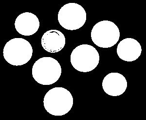

  - Adaptive threshold

```sh
.\ImageSegmentation.exe path/to/input/image.png path/to/output/image.png -threshold -adaptive <max-value> <kernel-size> <c>
```

Original | Adaptive thresholded (max-value = 255.0, kernel-size = 7, c = 8)
:--------------------------:|:--------------------------:
 | 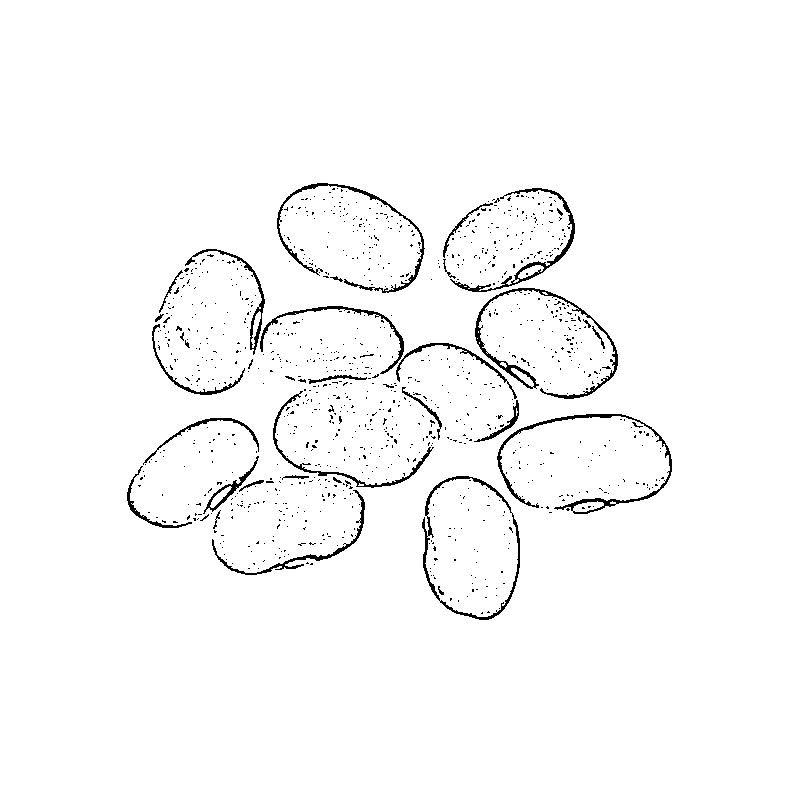


 - Otsu threshold

```sh
.\ImageSegmentation.exe path/to/input/image.png path/to/output/image.png -threshold -otsu
```

original | otsu thresholded
:--------------------------:|:--------------------------:
 | 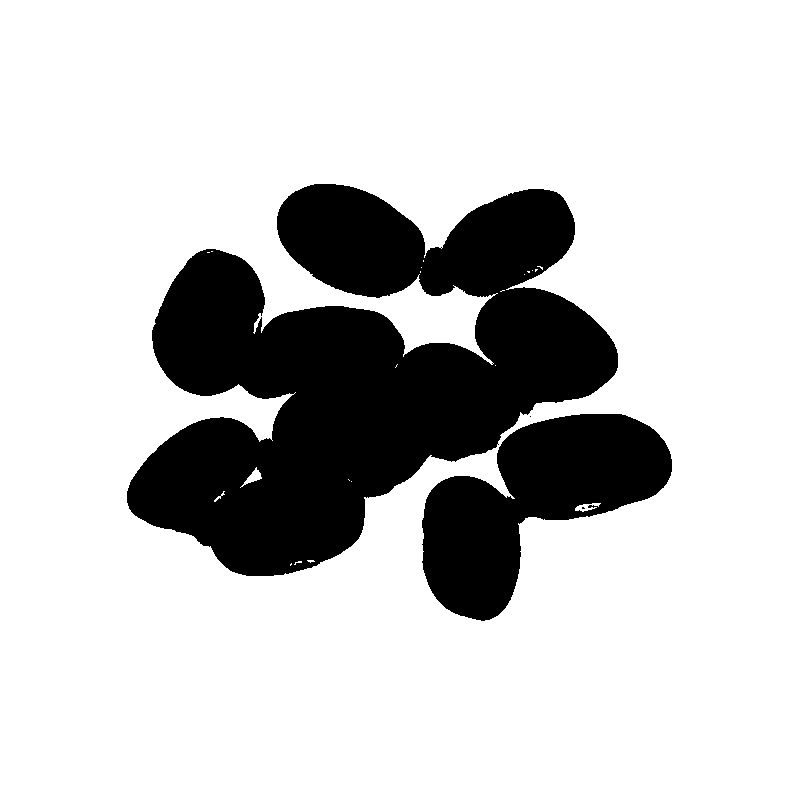

## Region-based method
- Region growing

```sh
.\ImageSegmentation.exe path/to/input/image.png path/to/output/image.png -region -grow 112
```

Original | Seed points | Region growing segmented (threshold = 112)
:--------------------------:|:--------------------------:|:--------------------------:
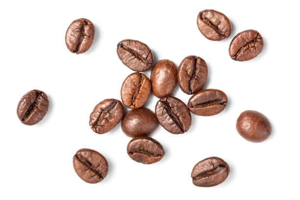 | 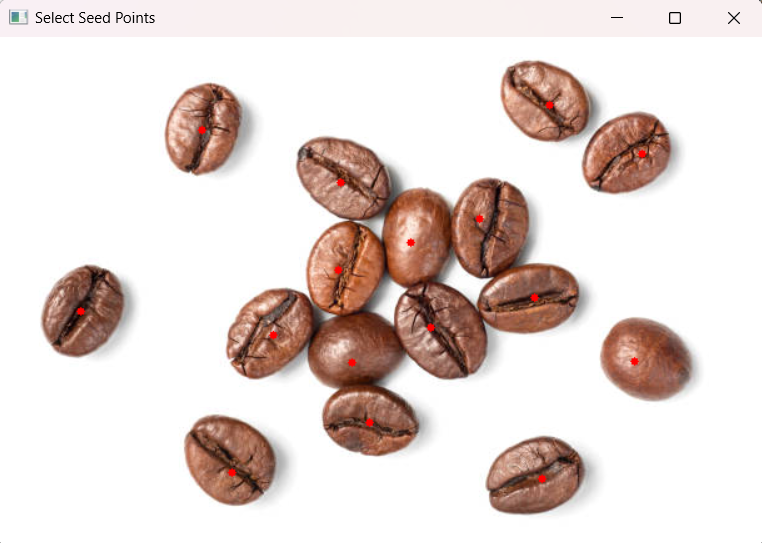 | 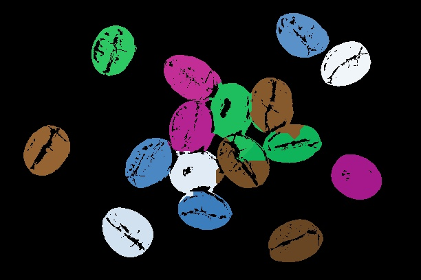

## Watershed 

```sh
.\ImageSegmentation.exe path/to/input/image.png path/to/output/image.png -watershed <flip-binary-threshold>
```

- flip-binary-threshold: if the foreground or objects is darker than the background, we may want to flip the binary thresholded image (by otsu method). Flip if 1 (true), do nothing otherwise.

Original | Watershed thresholded (flip-binary-threshold = 0)
:--------------------------:|:--------------------------:
 | 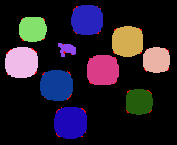
Original | Watershed thresholded (flip-binary-threshold = 1)
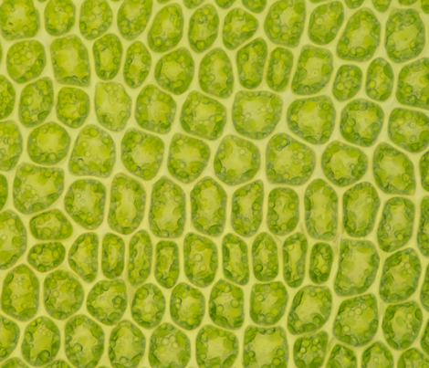 | 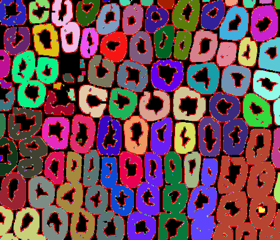
Original | Watershed thresholded (flip-binary-threshold = 0)
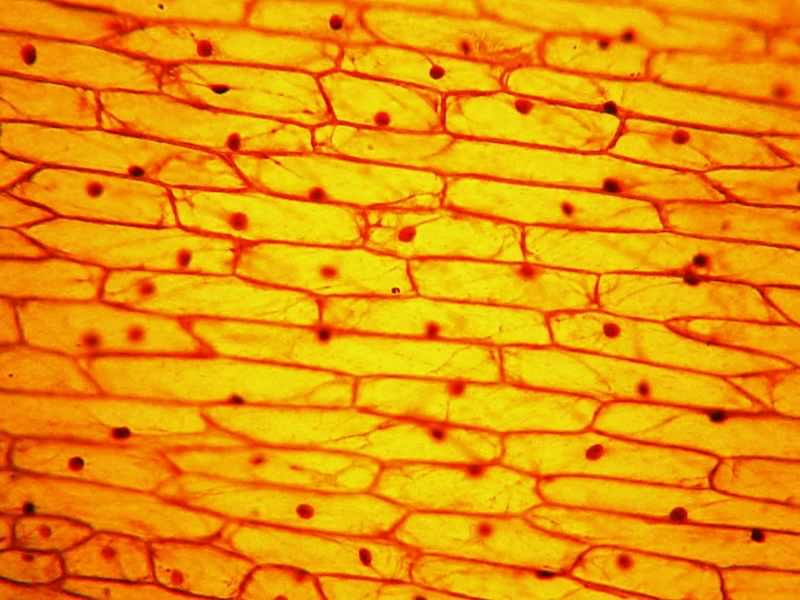 | 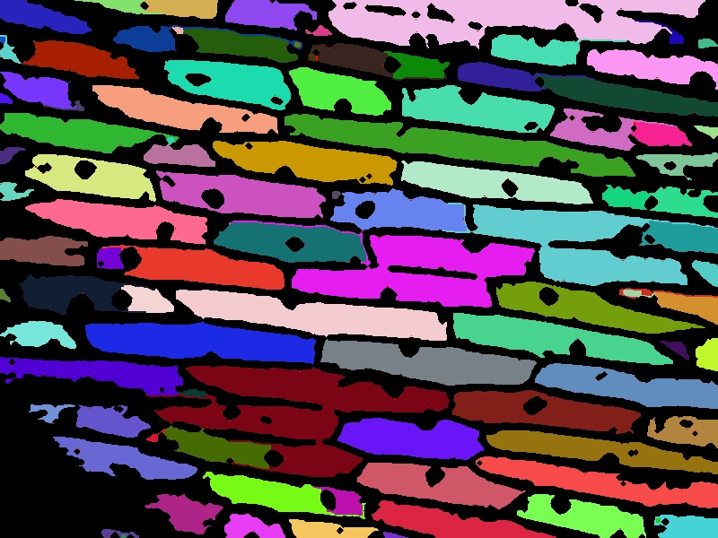

## K-means

```sh
.\ImageSegmentation.exe path/to/input/image.png path/to/output/image.png -kmeans <num-clusters> <max-iterations>
```

Original | K-means segmented (num-clusters = 3, max-iterations = 100)
:--------------------------:|:--------------------------:
 | 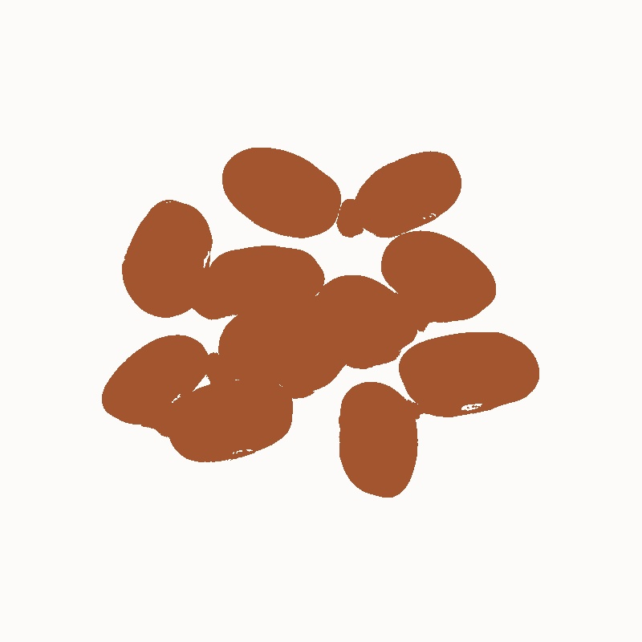

Original | K-means segmented (num-clusters = 6, max-iterations = 100)
:--------------------------:|:--------------------------:
 | 

## Mean shift

```sh
.\ImageSegmentation.exe path/to/input/image.png path/to/output/image.png -meanshift <spatial-radius> <color-radius> <max-iterations>
```

Original | Mean shift segmented (spatial-radius = 30.0, color-radius = 30.0, max-iterations = 100)
:--------------------------:|:--------------------------:
 | 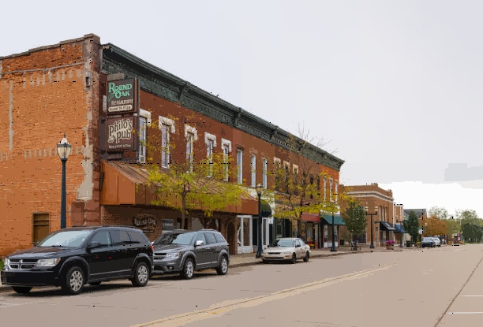